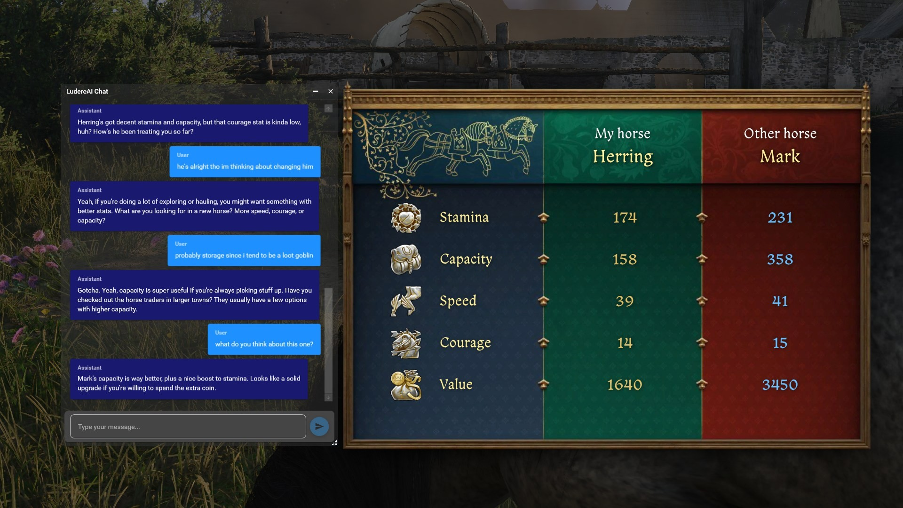
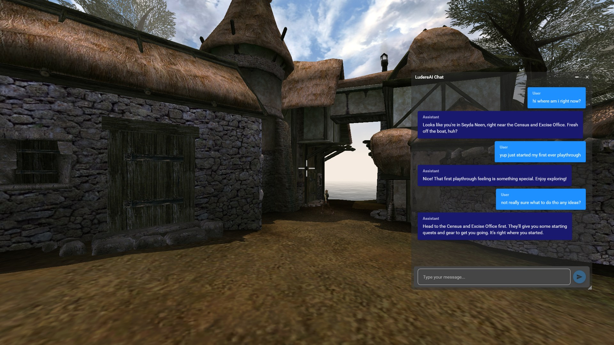
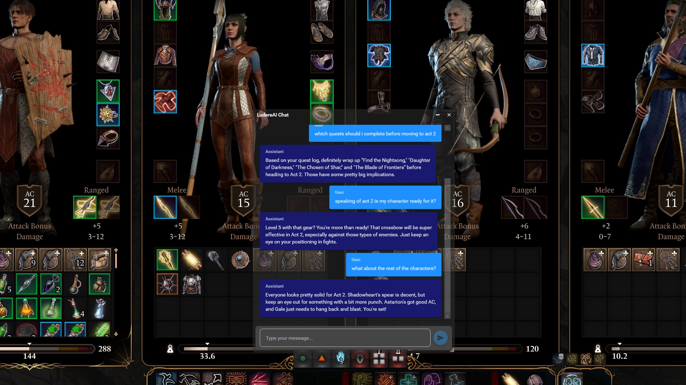

# LudereAI - Context-Aware AI Gaming Assistant

The AI Gaming Assistant That _Sees_ Your Game.

LudereAI utilizes computer vision by analyzing in-game screenshots to understand your gameplay situation. It provides personalized, contextual advice and information through an interactive chat interface, complete with optional text-to-speech responses.

## Getting Started

### 1. Download & Install
[**Download the latest `LudereAI` installer from the Releases page**](https://github.com/0xRoco/LudereAI/releases)

### 2. First-Time Setup
When you first run LudereAI, you will be prompted to enter an API key from an AI provider.
-   **This is required.** The application needs this key to communicate with an AI model.
-   You can get a key from services like [OpenAI](https://platform.openai.com/api-keys) or [Google AI Studio](https://aistudio.google.com/app/apikey).
-   Your key is encrypted and stored securely on your local machine.

## Key Features

- **AI Integration**: Powered by OpenAI-compatible APIs (for models like GPT, Gemini, etc.).
- **Automatic Game Detection**: Identifies the game you're playing to provide better context.
- **Visual Context**: Analyzes screenshots to understand what's happening on your screen.
- **Context-Aware Responses**: Provides relevant tips and information based on your current game state.
- **Interactive Chat Interface**: Have a natural conversation with an AI that understands gaming.
- **Text-to-Speech**: Listen to responses, with support for ElevenLabs, Piper, or Windows TTS.

## Project Status

LudereAI is a functional proof-of-concept. I believe the project serves as a strong foundation for what a context-aware AI gaming assistant can be, but there are many areas for improvement.

## License

This project is licensed under the MIT License - see the [LICENSE](LICENSE) file for details.

## Contributing
Contributions are welcome! If you have suggestions for improvements or new features, please open an issue or submit a pull request.

---

*Made with ❤️*
